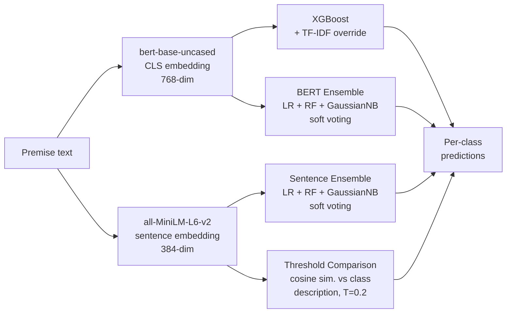

# SemEval-2023 — Task 4: Human Value Detection

> Four supervised and unsupervised approaches to identifying which of 20 human values an argument appeals to. Peer-reviewed paper at the SemEval 2023 workshop (ACL Anthology).

This repo contains the code for the **StFX-NLP** team submission to [SemEval 2023 Task 4: Human Value Detection (Touché)](https://touche.webis.de/semeval23/touche23-web/index.html).

📄 **[StFX-NLP at SemEval-2023 Task 4: Unsupervised and Supervised Approaches to Detecting Human Values in Arguments](https://aclanthology.org/2023.semeval-1.29/)** — Heavey, King, & Hughes (2023). *Proceedings of SemEval-2023*, pages 205–211.

## The task

Given an argument expressed as a (premise, stance, conclusion) triple, predict which of 20 categories from Schwartz's value continuum it appeals to. Examples of categories include *Self-direction: thought*, *Face*, *Universalism: nature*, and *Conformity: rules*. The task is multi-label — an argument can invoke several values at once.

The dataset (ValueEval'23) contains roughly 9,000 English arguments drawn from IBM's argument-quality dataset, the Conference for the Future of Europe, and group-discussion sources. **The central challenge is class imbalance** — some value categories are present in fewer than 2% of arguments, while others appear in over 50%.

## Four approaches

We built one supervised classifier, two ensemble classifiers, and one unsupervised model, all sharing two embedding strategies.



**XGBoost (BERT)** — Gradient-boosted trees over `[CLS]` embeddings, with a TF-IDF override on top: if a test premise contains a word type whose TF-IDF score ranks it in the top 1,000 for a given class, that class is asserted regardless of the XGBoost output. The TF-IDF threshold was tuned to maximise F1 over the range [10, 2000].

**BERT Ensemble** — Soft-voting ensemble of logistic regression, random forest, and Gaussian Naive Bayes over `[CLS]` embeddings. Soft voting (averaging class probabilities) was deliberately chosen over hard voting (majority class). On this class-imbalanced dataset, soft voting recovered rare classes that hard voting steamrolled — empirically about 10% higher macro-F1 with BERT embeddings and 22% higher with sentence embeddings.

**Sentence Ensemble** — Same three classifiers, but over `all-MiniLM-L6-v2` sentence embeddings instead of BERT `[CLS]` tokens. This was the best-performing of our four models on the test set.

**Threshold Comparison (unsupervised)** — Encode each class description using sentence embeddings, encode each premise the same way, and label a premise with class *c* if the cosine similarity exceeds a tuned threshold (T = 0.2). Crucially, we ablated *which parts* of the class description to encode (class name, summary, bullet-point left-half, bullet-point right-half) and found that name + right-half discriminated best — the summary was nearly identical across classes and washed out the cosine signal.

## Results

Per-class macro-F1 on the test set. Best model in **bold**; baselines and best-overall participant in grey.

| Approach | All | Self-dir:thought | Stim. | Hed. | Achiev. | Face | Sec:pers | Univ:nature |
|---|---|---|---|---|---|---|---|---|
| *Best overall (any team)* | .59 | .61 | .39 | .39 | .66 | .57 | .80 | .87 |
| *Best participant approach* | .56 | .57 | .32 | .25 | .66 | .53 | .76 | .82 |
| *Organiser BERT baseline* | .42 | .44 | .05 | .20 | .56 | .44 | .74 | .71 |
| **Sentence Ensemble (ours)** | **.40** | **.40** | **.07** | **.17** | **.47** | **.40** | **.71** | **.69** |
| BERT Ensemble (ours) | .33 | .29 | .14 | .20 | .46 | .34 | .55 | .34 |
| Threshold Comparison (ours) | .30 | .13 | .17 | .11 | .38 | .23 | .49 | .39 |
| XGBoost (ours) | .26 | .16 | .09 | .04 | .41 | .13 | .51 | .17 |
| *1-Baseline* | .26 | .17 | .09 | .03 | .41 | .12 | .51 | .17 |

(Selected columns shown — full 20-class table is in the paper.)

**Headline:** Our best model — Sentence Ensemble with soft voting — placed **77th of 111** submitted system runs and **34th of 39** teams overall. The Threshold Comparison model came in 94th and the XGBoost model 98th. All our supervised models surpassed the 1-baseline; XGBoost only just did.

## What we learned

- **Soft voting > hard voting on imbalanced multi-label problems.** Hard voting collapsed onto the dominant classes; soft voting let rarer classes win when the probability margin justified it.
- **Sentence-level embeddings beat `[CLS]` token embeddings** for both ensemble and unsupervised models, despite having half the dimensionality (384 vs 768).
- **Class description structure matters for unsupervised methods.** Including the generic "values it represents" paragraph hurt because it was nearly identical across classes and pulled all cosine similarities together. Including only the most discriminative phrases improved Threshold Comparison meaningfully.
- **Class imbalance is the dominant constraint.** Average F1 on classes with <2% representation (Stimulation, Hedonism, Conformity: interpersonal) was around 0.10–0.13; classes with >11% representation (Security: personal, Universalism: concern) scored 0.56–0.58. The gap was much larger than any modelling choice we tested.

## Future work

The paper suggests three directions: incorporating the Conclusion and Stance columns (we only embedded Premise), trying more recent embedding methods, and revisiting the unsupervised approach with different class-representation strategies.

## Key files

- **`main.py`** — runs all four models end-to-end on train/val
- **`Embed.py`** — generates BERT `[CLS]` and MiniLM sentence embeddings
- **`XGBoostUncased.py`** — XGBoost classifier with TF-IDF override
- **`Ensemble.py`** — soft-vote ensemble (LR + RF + GaussianNB)
- **`ThresholdComparison.py`** — unsupervised cosine-similarity classifier
- **`generate_tf_idf.py`** — TF-IDF feature generation per class
- **`save_results.py`** — formats predictions for TIRA submission
- **`Data/`**, **`JSON/`**, **`output/`** — task data, intermediate JSON, predictions

## Setup

```bash
git clone https://github.com/VeiledTee/SemEval-2023.git
cd SemEval-2023
pip install -r requirements.txt
```

Python 3.10.6. Major dependencies: pandas 1.5.0, numpy 1.23.3, scikit-learn 1.2.1, sentence-transformers 2.2.2, torch 1.13.1, transformers 4.23.1, xgboost 1.7.2.

## Usage

```bash
python main.py
```

This runs all four models on the train/validation splits with the hyperparameters tuned to F1.

## Citation

```bibtex
@inproceedings{heavey-etal-2023-stfx,
    title = "{S}t{FX}-{NLP} at {S}em{E}val-2023 Task 4: Unsupervised and Supervised Approaches to Detecting Human Values in Arguments",
    author = "Heavey, Ethan  and
      King, Milton  and
      Hughes, James",
    editor = {Ojha, Atul Kr.  and
      Do{\u{g}}ru{\"o}z, A. Seza  and
      Da San Martino, Giovanni  and
      Tayyar Madabushi, Harish  and
      Kumar, Ritesh  and
      Sartori, Elisa},
    booktitle = "Proceedings of the 17th International Workshop on Semantic Evaluation (SemEval-2023)",
    month = jul,
    year = "2023",
    address = "Toronto, Canada",
    publisher = "Association for Computational Linguistics",
    url = "https://aclanthology.org/2023.semeval-1.29/",
    doi = "10.18653/v1/2023.semeval-1.29",
    pages = "205--211",
    abstract = "In this paper, we discuss our models applied to Task 4: Human Value Detection of SemEval 2023, which incorporated two different embedding techniques to interpret the data. Preliminary experiments were conducted to observe important word types. Subsequently, we explored an XGBoost model, an unsupervised learning model, and two Ensemble learning models were then explored. The best performing model, an ensemble model employing a soft voting technique, secured the 34th spot out of 39 teams, on a class imbalanced dataset. We explored the inclusion of different parts of the provided knowledge resource and found that considering only specific parts assisted our models."
}
```

## Related work

The follow-up SemEval submission on lateral-thinking puzzles: [BrainTeaser (SemEval 2024 Task 9)](https://github.com/VeiledTee/BrainTeaser). Full PhD research portfolio at [github.com/VeiledTee](https://github.com/VeiledTee).
